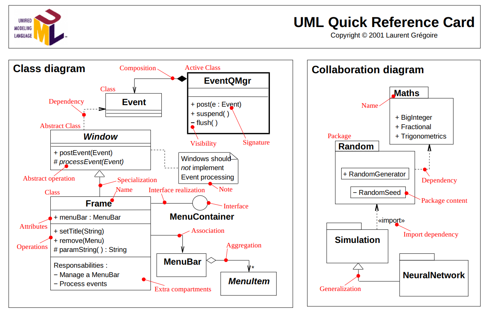

# Assignment 2: Answers

**Complete this document, commit your changes to Github and submit the repository URL to Canvas.** Keep your answers short and precise.

Your Name: Liv Tirjan

Used free extension: [ ] 24 hrs or [X] 48 hrs

[ ] Early submission (48 hrs)

[X] Bonus work. Describe: ...
Made custom find method and cleanString method in DSString. 
Got rid of all punctuation and digits from tweets.
Got rid of all words that were 2 characters or less. 

Place [x] for what applies.

## UML Diagram

Add your UML class diagram here.

Replace the following image with your diagram. You can draw it by hand and take a photo.

## Answers

1. How do you train the model and how do you classify a new tweet? Give a short description of the main steps.

    > 
To train the model, the Sentiment Analyzer reads and processes each line from the trainingDataFile, where each line comprises a tweet and its corresponding sentiment. Tweets are cleaned and tokenized into individual words, and word counts are updated in either positiveWordCounts or negativeWordCounts maps depending on the tweet's sentiment. This process helps the model learn which words are more commonly associated with positive or negative sentiments.

For classifying new tweets, the Sentiment Analyzer reads tweets from the testingDataFile and applies the learned word counts to predict sentiments. Each tweet is cleaned, tokenized, and analyzed to calculate sentiment scores, which determine whether a tweet is predicted as positive ('4') or negative ('0'). Predictions, including each tweet's ID and its predicted sentiment, are stored in the predictions map and also written to the outputPrediction file for reference.

2. How long did your code take for training and what is the time complexity of your training implementation (Big-Oh notation)? Remember that training includes reading the tweets, breaking it into words, counting, ... Explain why you get this complexity (e.g., what does `N` stand for and how do your data structures/algorithms affect the complexity).

   > The overall time complexity of my training process is O(N*M), where N is the number of tweets and M is the average number of words per tweet after cleaning. This complexity arises because for each tweet, the method performs operations that are linear in the number of words in that tweet, and it repeats these operations for every tweet in the dataset.

3. How long did your code take for classification and what is the time complexity of your classification implementation (Big-Oh notation)? Explain why.

   > The linear scan through the dataset to read and process each tweet contributes the O(N) factor.
The per-tweet operations (cleaning, tokenizing, and scoring) contribute the O(M) factor per tweet, leading to O(N*M) when considering all tweets. Efficient access to word counts in maps ensures constant-time lookup per word, but the need to process each word of each tweet is the main contributor to the overall complexity.Overall complexity: O(N*M)

4. What accuracy did your algorithm achieve on the provides training and test data? 

   > My accuracy: 65.6%

   The TA will run your code on Linux and that accuracy value will be used to determine your grade.

5. What were the changes that you made that improved the accuracy the most?
   
   > Only accepting words that were > 2 characters, getting rid of punctuation, and getting rid of numbers. 

6. How do you know that you use proper memory management? I.e., how do you know that you do not have
   a memory leak?

   > I followed the rule of three, I deallocated memory when it was no longer needed, and I used vectors and maps that manage their own memory. 

6. What was the most challenging part of the assignment?

   > It wasn't necessarily the actual coding but rather figuring out how GitHub and VSCode work and the settings.json file and CMake file. Also figuring out how to make test files and run them using terminal. I feel confident in the software now and was so excited when my program actually ran without errors, let alone getting a 65.6% accuracy! Yay
